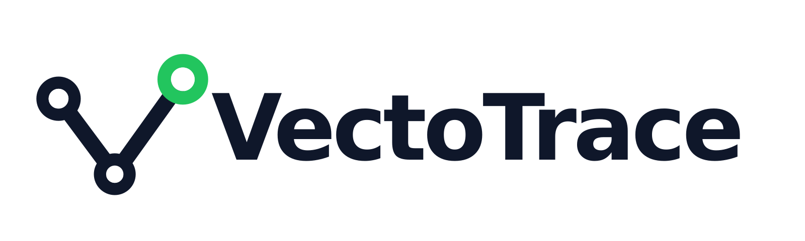

<div align="center">
  
</div>

## What is VectoTrace?

VectoTrace is a self-hosted uptime monitoring, incident response, alerting, and public status pages solution for teams that need to know when a service fails—and explain what happened next.

It watches web services and infrastructure from your own environment. It schedules checks in the background, records response and timing data, turns sustained failures into incidents, notifies the right channels, and publishes service health through customizable status pages.

## Features

- **Own the operational data:** Check history, incidents, subscribers, and alert configuration remain in infrastructure you control.
- **Monitor more than HTTP:** A service can be reachable while its content, JSON response, certificate, DNS record, TCP port, domain, or scheduled job is unhealthy.
- **Reduce alert noise:** An incident opens after three consecutive failures and automatically resolves after five consecutive successful recovery checks.
- **Make latency actionable:** HTTP checks can capture DNS, connection, TLS, time-to-first-byte, and total response time.
- **Unify response and communication:** The same monitor state drives the dashboard, alerts, incident timelines, public status pages, feeds, badges, and subscriber notifications.
- **Fit existing operations:** API tokens support automation, Prometheus exposes metrics, Apprise expands notification delivery, and Docker keeps deployment portable.

## Tech Stack

- **API**: Python 3.12, Django 5.2, Django REST Framework
- **Authentication**: Simple JWT, hashed API tokens, Argon2
- **Background Work**: Celery 5, django-celery-beat
- **Data**: PostgreSQL with connection pooling
- **Coordination & Events**: Redis
- **Notifications**: Webhooks and Apprise
- **Dashboard**: Next.js 16, React 19, TypeScript, Tailwind CSS 4, TanStack Query
- **Deployment**: Docker and Docker Compose

## Getting Started

### Prerequisites

- Docker Engine with the Compose plugin
- Git

### 1. Clone and configure

```bash
git clone <your-repository-url> vectotrace
cd vectotrace
```

Create a root `.env` file. Replace the example credentials before exposing the service beyond your machine.

```dotenv
SECRET_KEY=replace-with-a-long-random-secret
DEBUG=False

DB_USER=vectotrace
DB_PASS=replace-with-a-strong-password
DB_NAME=vectotrace
DB_HOST=localhost
DB_PORT=5434

REDIS_URL=redis://localhost:6380/1
DJANGO_PORT=8000
ALLOWED_HOSTS=localhost,127.0.0.1
CORS_ALLOWED_ORIGINS=http://localhost:3000,http://127.0.0.1:3000

INSTANCE_REGION=default
RAW_CHECK_RETENTION_DAYS=90
PUBLIC_BASE_URL=http://localhost:3000
SUBSCRIBER_EMAIL_URL=
MONITOR_ALLOW_INTERNAL_TARGETS=False
```

### 2. Start the backend stack

```bash
docker compose up --build -d
docker compose ps
curl http://localhost:8000/api/v1/health/ready/
```

This starts PostgreSQL, Redis, Django, a Celery worker, and Celery Beat. Database migrations run from the API container during startup.

### 3. Deploy the frontend

You can either run the frontend locally or deploy it to Vercel. To run it locally:

```bash
cd frontend
npm ci
NEXT_PUBLIC_API_URL=http://localhost:8000 npm run dev
```

Open:

- Dashboard: <http://localhost:3000>
- API: <http://localhost:8000/api/v1/>
- Django admin: <http://localhost:8000/admin/>

Registration automatically creates an initial organization and makes the new user its administrator.
